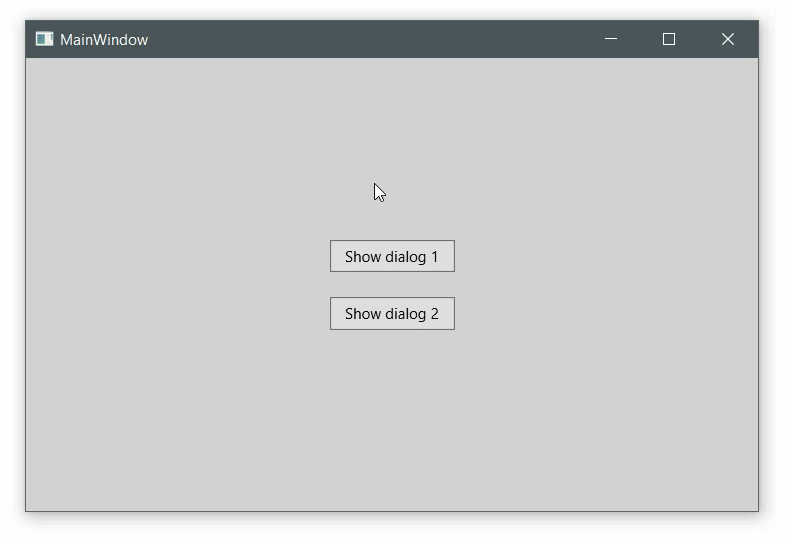

[](LICENSE)

# DialogHost
This is a WPF UserControl template that allows to create good looking dialogs :speech_balloon: with just a few standard components. It does support MVVM and has been built on .NET Core 3.1.



To use this dialog host, add a user control at the bottom of the window, that the dialog is supposed to cover. In the connected viewmodel add a property containing an interface to a dialog service and set this as the data context of the user control. Only a single instance of a dialogservice per dialog host is required. For all dialogs that you want to display, create a data template in your application or window resources to connect view and viewmodel. Fill the viewmodels of the dialogs as shown in the sample. To display a dialog, call the ShowDialog method of the service and set an instance of your dialog view model. The dialog will appear in width and height you set in the view. If you do not specify any width or height, it will fill the entire user control.

The red background color is for demonstration purposes only. Change it to any color you like by modifying the control template. You can also adjust the speed of the animation to your likening.

## Contact
If you need any help, contact me! :raising_hand_man:

## License
```
MIT License

Copyright (c) 2020 Andreas Seutemann

Permission is hereby granted, free of charge, to any person obtaining a copy
of this software and associated documentation files (the "Software"), to deal
in the Software without restriction, including without limitation the rights
to use, copy, modify, merge, publish, distribute, sublicense, and/or sell
copies of the Software, and to permit persons to whom the Software is
furnished to do so, subject to the following conditions:

The above copyright notice and this permission notice shall be included in all
copies or substantial portions of the Software.

THE SOFTWARE IS PROVIDED "AS IS", WITHOUT WARRANTY OF ANY KIND, EXPRESS OR
IMPLIED, INCLUDING BUT NOT LIMITED TO THE WARRANTIES OF MERCHANTABILITY,
FITNESS FOR A PARTICULAR PURPOSE AND NONINFRINGEMENT. IN NO EVENT SHALL THE
AUTHORS OR COPYRIGHT HOLDERS BE LIABLE FOR ANY CLAIM, DAMAGES OR OTHER
LIABILITY, WHETHER IN AN ACTION OF CONTRACT, TORT OR OTHERWISE, ARISING FROM,
OUT OF OR IN CONNECTION WITH THE SOFTWARE OR THE USE OR OTHER DEALINGS IN THE
SOFTWARE.
```
